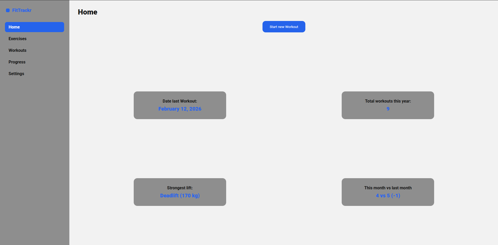

# FitTrackr

## Inhoudsopgave

1. [Inleiding](#1-inleiding)
2. [Screenshot](#2-screenshot)
3. [Gebruikte technieken](#3-gebruikte-technieken)
4. [Installatiehandleiding](#4-installatiehandleiding)
5. [Inloggegevens](#5-inloggegevens)
6. [Beschikbare npm-commando's](#6-beschikbare-npm-commandos)
7. [JSON-configuratiebestand NOVI Dynamic API](#7-json-configuratiebestand-novi-dynamic-api)

---

## 1. Inleiding

FitTrackr is een webapplicatie waarmee gebruikers hun workouts kunnen aanmaken, uitvoeren en hun voortgang kunnen bijhouden.

**Doel van de applicatie**

Het doel van de applicatie is om sporters inzicht te geven in hun trainingsprestaties, zoals:

- Aantal workouts per jaar
- Laatste trainingsdatum
- Sterkste lift
- Maandelijkse trainingsvergelijking

**Belangrijkste functionaliteiten:**

- Inloggen en uitloggen
- Workouts aanmaken en bewerken
- Oefeningen toevoegen aan workouts
- Workouts afronden (finish workout)
- Automatische registratie in voortgangsoverzicht
- Dashboard met statistieken
- Adminpagina voor gebruikersbeheer en oefeningen beheren

---

## 2. Screenshot



---

## 3. Gebruikte technieken

Deze applicatie is gebouwd met:

**Frontend**
- React
- React Router
- Vite
- CSS (zelfgeschreven, geen frameworks)

**Backend**
- NOVI Dynamic API

**Overig**
- JavaScript (ES6+)
- REST API (HTTP requests via fetch)

---

## 4. Installatiehandleiding

Volg onderstaande stappen om het project lokaal te draaien.

### Stap 1 – Repository clonen

```bash
git clone https://github.com/Nikososos/Fittrackr.git
cd Fittrackr
```

### Stap 2 – Dependencies installeren

```bash
npm install
```

### Stap 3 – Environment variabelen instellen

In de root van het project staat een `.env.dist` bestand met de benodigde variabelenamen. Kopieer dit bestand naar een nieuw `.env` bestand:

```bash
cp .env.dist .env
```

Vul daarna het `.env` bestand in met de onderstaande waarden.

```
VITE_NOVI_BASE_URL=https://novi-backend-api-wgsgz.ondigitalocean.app
VITE_NOVI_PROJECT_ID=9ac06ce7-6546-406f-ae4d-ca8f5020c3a1
```

> **Let op:** Na het aanmaken of aanpassen van het `.env` bestand moet je de development server opnieuw starten. Stop de server met `CTRL + C` en start hem opnieuw op met `npm run dev`.

### Stap 4 – Applicatie starten

```bash
npm run dev
```

De applicatie is bereikbaar via:

```
http://localhost:5173
```

> **Let op:** Als de applicatie je doorstuurt naar `http://127.0.0.1:5173`, pas dan de URL in je browser handmatig aan naar `http://localhost:5173`. Als je dit niet doet, krijg je een CORS-fout bij het inloggen.

---

## 5. Inloggegevens

Er zijn standaardaccounts beschikbaar om de applicatie te testen:

**Admin account**
- Email: `admin@fittrackr.nl`
- Wachtwoord: `admin123`

**Demo gebruikers**
- Email: `demo2@fittrackr.nl`
- Wachtwoord: `demo123`

- Email: `demo3@fittrackr.nl`
- Wachtwoord: `demo456`
---

## 6. Beschikbare npm-commando's

| Commando | Beschrijving |
|---|---|
| `npm run dev` | Start de applicatie in development mode |
| `npm run build` | Maakt een productieversie van de applicatie |
| `npm run preview` | Start een lokale preview van de productieversie |

---

## 7. JSON-configuratiebestand NOVI Dynamic API

Bij deze opdracht wordt een apart JSON-configuratiebestand meegeleverd voor de NOVI Dynamic API. Dit bestand bevat:

- Collecties met velden en permissions
- Vooraf ingevulde gebruikersaccounts voor testdoeleinden

Dit bestand moet worden geüpload via het NOVI API-dashboard op het adres van de `VITE_NOVI_BASE_URL`, gekoppeld aan het project-ID uit het `.env` bestand.
